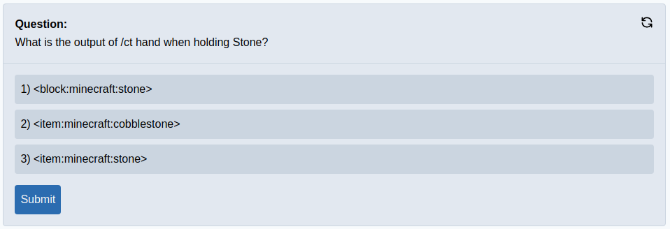

# Custom Markdown used

While most of the docs are written in GitHub Flavoured Markdown, we use the [Remark-Directive](https://github.com/remarkjs/remark-directive) plugin to create some elements that stand out and help the user.

### Required Mods

To show that a mod is required for certain pages, we use the following syntax:

```
::requiredMod[Create]{builtIn=false modLink=https://www.curseforge.com/minecraft/mc-mods/create requiredMod=CreateTweaker requiredModLink=https://www.curseforge.com/minecraft/mc-mods/createtweaker}

::requiredMod[Immersive Engineering]{builtIn=true}
```

`builtIn` defines whether the support is added by the mod in question (Like Thermal Series having the support be in their mod), or if an addon mod is required (Like CreateTweaker being required to add support for Create).

`modLink` is a link to the mod's project page.

`requiredMod` is the display name of the required addon.

`requiredModLink` is the link to the required addon's project page.

When rendered on the actual site, this turns into:


### Questions

For a more immersive "follow along" type tutorial, you can use the following syntax:

```
:::question[What is the output of /ct hand when holding Stone?]

::answer[<item:minecraft:cobblestone>]{correct=false id=1}
::answer[<item:minecraft:stone>]{correct=true id=2}
::answer[<block:minecraft:stone>]{correct=false id=3}
:::
```

`correct` defines if the answer is the correct answer to the question.

`id` is used to track answers as they are randomized on each render.

When rendered on the actual site, this turns into:
